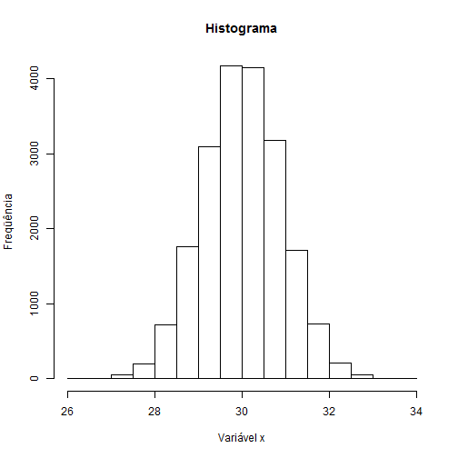
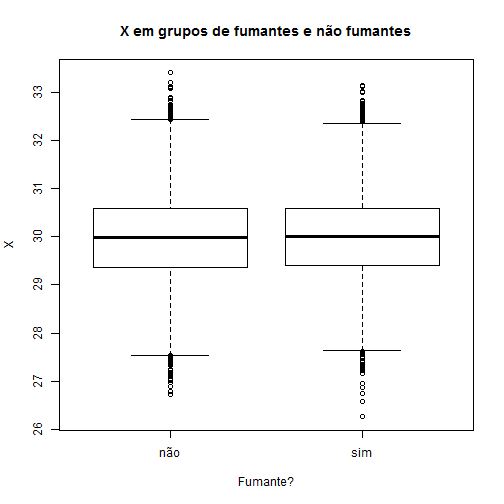

Alguns gráficos bonitinhos
========================================================
author: Abrantes Araújo Silva Filho
date: 2017-05-16
autosize: true

Histograma
========================================================

Dados gerados com rnorm:

```r
x <- rnorm(20000, mean = 30, sd = 0.9)
hist(x, main = "Histograma",
        xlab = "Variável x",
        ylab = "Freqüência")
```




Box-and-Whisker Plots
========================================================


```r
fumante.n <- rbinom(20000, 1, .34)
fumante.f <- factor(fumante.n,
                    levels = c(0, 1),
                    labels = c("não", "sim"),
                    ordered = TRUE)
boxplot(x ~ fumante.f, main = "X em grupos de fumantes e não fumantes",
            xlab = "Fumante?",
            ylab = "X")
```


